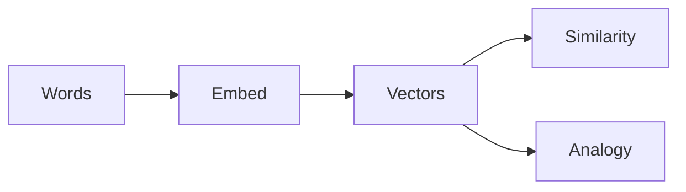

# Word Embeddings — From One-Hot to Vectors

> "Words are the shadows of ideas."
> — (embeddings as shadows of meaning)

---
layout: default
---

# Conceptual Core

- One-hot: high-dim, no similarity
- Word2Vec, GloVe: distributional hypothesis
- Embedding space: similarity, analogy

---
layout: default
---

# Conceptual Core (continued)

- BPE, SentencePiece: subword tokens

---
layout: default
---

# Technical Example

- Load embeddings, cosine similarity
- Analogies
- Lab 1: Embeddings, similarity

---
layout: default
---

# Technical Example (continued)

- Visualize: PCA, t-SNE

---
layout: default
---

# Philosophical Reflection

- Meaning as vector vs. meaning as use
- Geometry of semantic space
- Shadows of ideas
.Figure 6.1: Embedding space (similarity, analogy)
[plantuml,ch06-l01,png,theme=sketchy-outline]
....
@startuml
start
:Words;
:Embed;
:Vectors;
:Similarity;
:Analogy;
stop
@enduml
....

---
layout: default
---

# Discussion Prompts

- When do embeddings capture "meaning" and when do they fail?
- What is lost in the compression to vectors?
- How does subword tokenization change the semantics?

---
layout: default
---

# Diagram

---
layout: default
---

# Lab Prep

- Lab 1: Embeddings, similarity
- Feeds Ch7 retrieval, llm tool

---
layout: center
---

# Questions?
