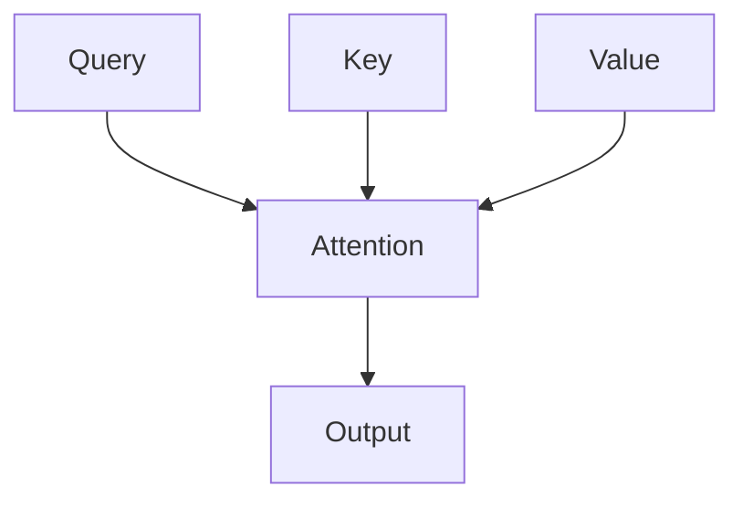

# Attention and the Transformer

> "Attention is all you need."
> — Vaswani et al.

---
layout: default
---

# Conceptual Core

- Self-attention: Q, K, V; scaled dot-product
- Multi-head: multiple projections
- Transformer: encoder, decoder

---
layout: default
---

# Conceptual Core (continued)

- Positional encoding
- Long-range dependencies

---
layout: default
---

# Technical Example

- Trace Q, K, V, attention
- Visualize attention weights
- Lab 2: Prompts leveraging attention

---
layout: default
---

# Philosophical Reflection

- Attention = selective focus
- Relevance learned from data
- General-purpose sequence processor
.Figure 6.2: Self-attention and transformer block
[plantuml,ch06-l02,png,theme=sketchy-outline]
....
@startuml
start
:Query;
:Attention;
:Key;
:Value;
:Output;
stop
@enduml
....

---
layout: default
---

# Discussion Prompts

- What does "attention" mean for the model?
- Why does the transformer scale better than RNNs?
- Is attention a form of "working memory"?

---
layout: default
---

# Diagram

---
layout: default
---

# Lab Prep

- Lab 2: Prompt design
- Structure for attention
- Key info placement

---
layout: center
---

# Questions?
