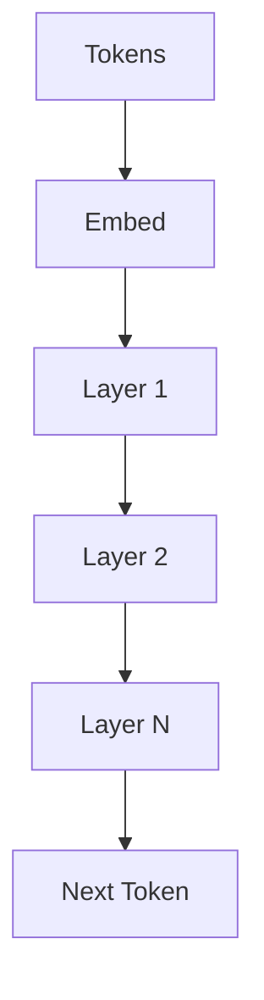

# Large Language Models — Pretraining and Fine-Tuning

> "The model has read the internet—and internalized its biases."
> — (adapted)

---
layout: default
---

# Conceptual Core

- Pretraining: next-token prediction
- Scaling laws: data, params → emergent abilities
- Fine-tuning: full, LoRA, prefix

---
layout: default
---

# Conceptual Core (continued)

- Instruct tuning, alignment
- Internalized biases

---
layout: default
---

# Technical Example

- Load LLM, generate
- Base vs. instruct behavior
- Lab 2: Generation, prompt templates

---
layout: default
---

# Philosophical Reflection

- Emergence from scale
- Opacity of scaled representations
- Inherited biases
.Figure 6.3: LLM architecture (decoder-only, layers)
[plantuml,ch06-l03,png,theme=sketchy-outline]
....
@startuml
start
:Tokens;
:Embed;
:Layer 1;
:Layer 2;
:Layer N;
:Next Token;
stop
@enduml
....

---
layout: default
---

# Discussion Prompts

- What counts as "emergent" vs. "learned"?
- How do we handle inherited biases?
- Is alignment possible or always partial?

---
layout: default
---

# Diagram

---
layout: default
---

# Lab Prep

- Lab 2: Generation, prompt templates
- Templates = agent–model interface

---
layout: center
---

# Questions?
