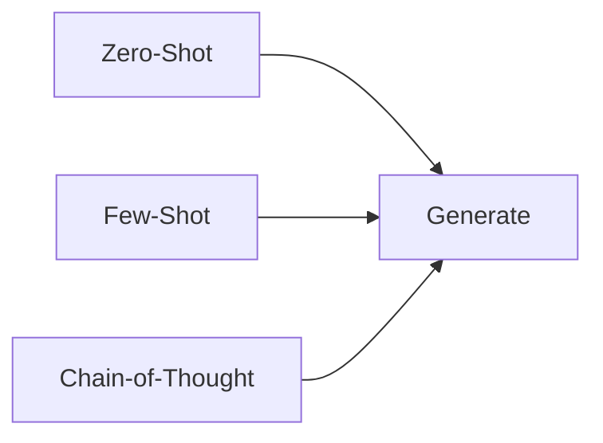

# Prompting — Zero-Shot, Few-Shot, Chain-of-Thought

> "The prompt is the interface."
> — (adapted)

---
layout: default
---

# Conceptual Core

- Zero-shot: direct instruction
- Few-shot: examples in context
- Chain-of-thought: step-by-step reasoning

---
layout: default
---

# Conceptual Core (continued)

- Prompt engineering: clarity, format, constraints
- Unpredictable results

---
layout: default
---

# Technical Example

- Compare: zero-shot, few-shot, CoT
- Task-specific prompts
- Lab 2: Prompt library

---
layout: default
---

# Philosophical Reflection

- Prompt = epistemic scaffold
- Follow vs. simulate
- Programming in natural language
.Figure 6.4: Prompt structures
[plantuml,ch06-l04,png,theme=sketchy-outline]
....
@startuml
start
:Zero-Shot;
:Generate;
:Few-Shot;
:Chain-of-Thought;
stop
@enduml
....

---
layout: default
---

# Discussion Prompts

- When does few-shot help and when does it hurt?
- Is chain-of-thought "reasoning" or "stylized output"?
- Who is responsible when a prompt produces harmful output?

---
layout: default
---

# Diagram

---
layout: default
---

# Lab Prep

- Lab 2: Prompt library
- Document purpose, I/O, failures
- Shared infrastructure

---
layout: center
---

# Questions?
