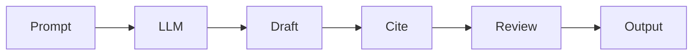

# Knowledge Engineering and AI-Mediated Communication

> "Writing is thinking made visible."
> — (AI-mediated writing)

---
layout: default
---

# Conceptual Core

- Knowledge engineering: precise prompts
- Citation-aware: reduce hallucination
- Summarization vs. synthesis

---
layout: default
---

# Conceptual Core (continued)

- Structured output: JSON, markdown
- Writing as delegated cognition
- Authorship question

---
layout: default
---

# Technical Example

- Report with citations
- Evaluate accuracy
- Structured output

---
layout: default
---

# Technical Example (continued)

- Lab 3: Docs/markdown integration

---
layout: default
---

# Philosophical Reflection

- Delegated cognition
- Distributed authorship
- Epistemic stakes
.Figure 6.5: AI-mediated writing pipeline
[plantuml,ch06-l05,png,theme=sketchy-outline]
....
@startuml
start
:Prompt;
:LLM;
:Draft;
:Cite;
:Review;
:Output;
stop
@enduml
....

---
layout: default
---

# Discussion Prompts

- When are citations sufficient to reduce hallucination?
- Who is the author of AI-generated text?
- How do we evaluate "quality" of AI writing?

---
layout: default
---

# Diagram

---
layout: default
---

# Lab Prep

- Lab 3: Docs/markdown pipeline
- Structured output
- Downstream processing

---
layout: center
---

# Questions?
