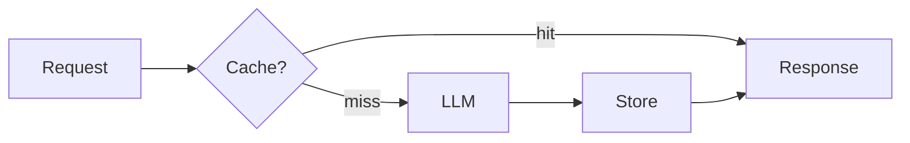

# Caching, Rate Limits, and Cost

> "Every API call has a cost—monetary and epistemic."
> — (adapted)

---
layout: default
---

# Conceptual Core

- Caching: identical prompt → reuse
- Rate limits, backoff, retry
- Cost per token

---
layout: default
---

# Conceptual Core (continued)

- Batching, async
- Caching as memory (Ch7)

---
layout: default
---

# Technical Example

- Cache: key = prompt_hash + model
- Measure cost, latency
- Lab 3: Cache in llm tool

---
layout: default
---

# Philosophical Reflection

- Access = material condition
- Caching extends access
- Cache = episodic memory
.Figure 6.6: LLM pipeline with cache layer
[plantuml,ch06-l06,png,theme=sketchy-outline]
....
@startuml
start
:Request;
:Response;
:LLM;
:Store;
stop
@enduml
....

---
layout: default
---

# Discussion Prompts

- Who is excluded when LLM access is costly?
- When should we *not* cache (freshness)?
- Is caching a form of memory?

---
layout: default
---

# Diagram

---
layout: default
---

# Lab Prep

- Lab 3: Cache in llm tool
- Key: prompt + model
- Optional TTL

---
layout: center
---

# Questions?
