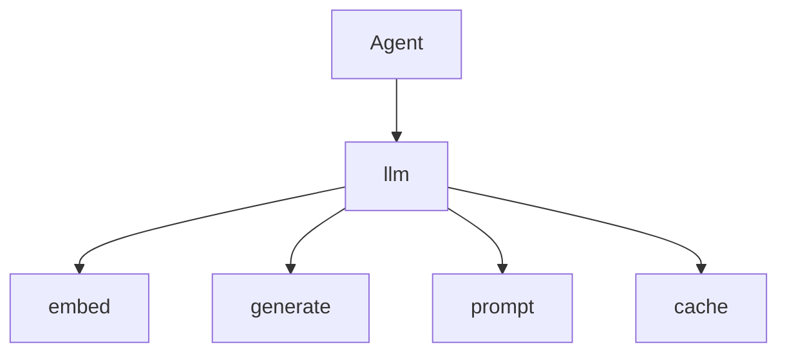

# The llm Tool — Embed, Generate, Cache

> "The LLM is the agent's language organ."
> — (adapted)

---
layout: default
---

# Conceptual Core

- Tools: embed, generate, prompt, cache
- Orchestration: prompt → LLM → postprocess
- Memory: embed for retrieval

---
layout: default
---

# Conceptual Core (continued)

- OpenRouter, local routing
- Agent "thinks" vs. "queries"

---
layout: default
---

# Technical Example

- Schema: embed, generate, prompt, cache
- Agent: embed for similarity, generate for task
- Lab 3: Complete pipeline, integrate memory

---
layout: default
---

# Philosophical Reflection

- LLM = epistemic delegate
- Agent reasons about calls
- Agent + LLM = cognitive system
.Figure 6.7: llm in agent stack
[plantuml,ch06-l07,png,theme=sketchy-outline]
....
@startuml
start
:Agent;
:llm;
:embed;
:generate;
:prompt;
:cache;
stop
@enduml
....

---
layout: default
---

# Discussion Prompts

- Where is "thinking" in the agent–LLM system?
- When should the agent use embed vs. generate?
- Is the LLM a "tool" or a "component"?

---
layout: default
---

# Diagram

---
layout: default
---

# Lab Prep

- Lab 3: Complete pipeline
- Integrate memory for RAG
- Test embed, generate

---
layout: center
---

# Questions?
