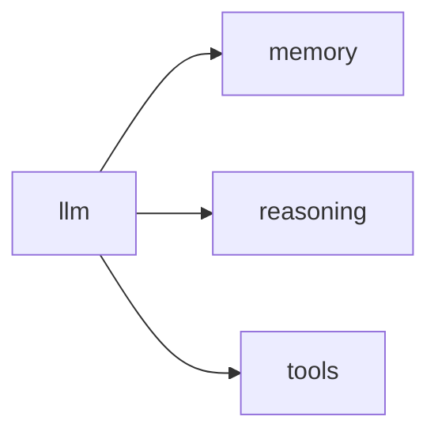

# Lab Integration — Prompt/LLM Pipeline

> "Language is the house of being."
> — Heidegger (the llm as linguistic infrastructure)

---
layout: default
---

# Conceptual Core

- Recap: embed, generate, prompt, cache
- student-ai/llm/
- Connections: memory, reasoning, tools

---
layout: default
---

# Conceptual Core (continued)

- Linguistic substrate
- Metabolism of language

---
layout: default
---

# Technical Example

- End-to-end: RAG, generation, tool choice
- Submodule
- Feeds memory, reasoning, tools

---
layout: default
---

# Philosophical Reflection

- Linguistic substrate
- House of being
- Metabolism of language
.Figure 6.8: llm and downstream consumers
[plantuml,ch06-l08,png,theme=sketchy-outline]
....
@startuml
start
:llm;
:memory;
:reasoning;
:tools;
stop
@enduml
....

---
layout: default
---

# Discussion Prompts

- Is the llm "central" or "one among many"?
- How does the metabolism metaphor apply to language?
- What would the agent be without the llm?

---
layout: default
---

# Diagram

---
layout: default
---

# Lab Prep

- Complete Labs 1–3, submit
- Integrate in student-ai/llm/
- Ch7: Memory, RAG

---
layout: center
---

# Questions?
