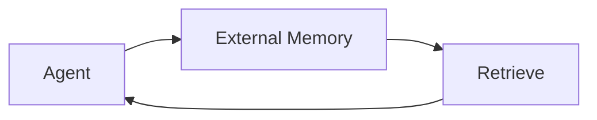

# Memory in AI — The Need for External Storage

> "Memory is not storage—it is reconstruction."
> — Bartlett (adapted)

---
layout: default
---

# Conceptual Core

- Context window limits; persistence; scalability
- Episodic, semantic, procedural
- Memory as infrastructure

---
layout: default
---

# Conceptual Core (continued)

- Memory = reconstruction, not copy
- External memory = delegation

---
layout: default
---

# Technical Example

- In-context vs. external
- Context window = bottleneck
- Lab 1: Vector store backend

---
layout: default
---

# Philosophical Reflection

- Memory and identity
- Agent + memory = cognitive system
- Self vs. tool
.Figure 7.1: Agent with external memory
[plantuml,ch07-l01,png,theme=sketchy-outline]
....
@startuml
start
:Agent;
:External Memory;
:Retrieve;
stop
@enduml
....

---
layout: default
---

# Discussion Prompts

- Is external memory "really" the agent's memory?
- What should the agent remember vs. forget?
- How does memory shape identity?

---
layout: default
---

# Diagram

---
layout: default
---

# Lab Prep

- Lab 1: Vector store backend
- Pipeline: chunk → embed → index
- Foundation for RAG

---
layout: center
---

# Questions?
