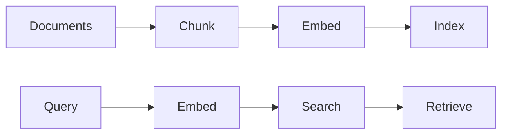

# Vector Stores and Similarity Search

> "Similarity is not identity—but it is often enough."
> — Embeddings

---
layout: default
---

# Conceptual Core

- Dense vectors, cosine/dot product
- ANN: HNSW, IVF
- Chunking strategy

---
layout: default
---

# Conceptual Core (continued)

- Pipeline: chunk → embed → index
- Politics of similarity

---
layout: default
---

# Technical Example

- Chunk, embed, index
- Query: embed, search, top-k
- Lab 1: Index, search API

---
layout: default
---

# Philosophical Reflection

- Similarity ≠ identity
- Bias in embeddings → bias in retrieval
.Figure 7.2: Vector store pipeline (index, query)
[plantuml,ch07-l02,png,theme=sketchy-outline]
....
@startuml
start
:Documents;
:Chunk;
:Embed;
:Index;
:Query;
:Search;
:Retrieve;
stop
@enduml
....

---
layout: default
---

# Discussion Prompts

- When is similarity "enough" and when does it fail?
- How does chunking affect retrieval?
- What are the politics of "relevant"?

---
layout: default
---

# Diagram

---
layout: default
---

# Lab Prep

- Lab 1: Index, search API
- Feeds RAG

---
layout: center
---

# Questions?
