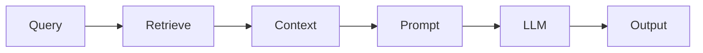

# RAG — Retrieval-Augmented Generation

> "Retrieval grounds generation—or tries to."
> — RAG

---
layout: default
---

# Conceptual Core

- Pipeline: query → retrieve → concatenate → generate
- Knowledge without retraining
- Chunking, reranking

---
layout: default
---

# Conceptual Core (continued)

- Helps: factual QA, domain
- Hurts: bad retrieval

---
layout: default
---

# Technical Example

- Build: embed, retrieve, prompt, generate
- Evaluate: with vs. without
- Lab 2: RAG, optional reranking

---
layout: default
---

# Philosophical Reflection

- Grounding: hope, not guarantee
- Retrieved vs. generated: blurry
- Model can ignore context
.Figure 7.3: RAG pipeline
[plantuml,ch07-l03,png,theme=sketchy-outline]
....
@startuml
start
:Query;
:Retrieve;
:Context;
:Prompt;
:LLM;
:Output;
stop
@enduml
....

---
layout: default
---

# Discussion Prompts

- When does RAG reduce hallucination?
- How do we evaluate "grounded" generation?
- What if retrieval returns wrong context?

---
layout: default
---

# Diagram

---
layout: default
---

# Lab Prep

- Lab 2: RAG pipeline
- Optional reranking
- Integrates llm, vector store

---
layout: center
---

# Questions?
