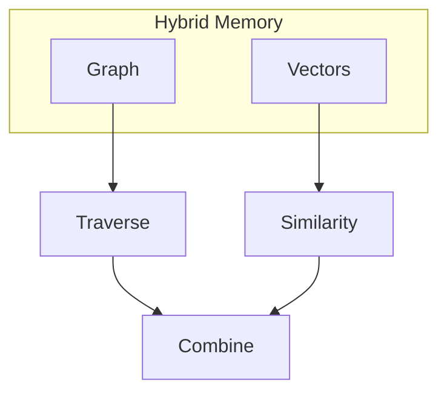

# Symbolic Memory — Graphs and Knowledge Bases

> "Symbols point; vectors approximate."
> — (hybrid memory)

---
layout: default
---

# Conceptual Core

- Knowledge graphs: nodes, edges
- Hybrid: graph filter + vector rank
- Symbolic: structure, relations

---
layout: default
---

# Conceptual Core (continued)

- Vector: similarity
- Ch1 graph = symbolic layer

---
layout: default
---

# Technical Example

- Graph query + vector rank
- Lab 3: Symbolic layer
- Integrate Ch1 graph

---
layout: default
---

# Philosophical Reflection

- Complementarity, not opposition
- Symbols point; vectors approximate
- Structure = epistemic choice
.Figure 7.4: Hybrid memory (graph + vectors)
[plantuml,ch07-l04,png,theme=sketchy-outline]
....
@startuml
start
:"Hybrid Memory";
:Graph;
:Vectors;
:Traverse;
:Similarity;
:Combine;
stop
@enduml
....

---
layout: default
---

# Discussion Prompts

- When is symbolic retrieval better than vector?
- What does "hybrid" mean for the agent's memory?
- How does the Ch1 graph connect to memory?

---
layout: default
---

# Diagram

---
layout: default
---

# Lab Prep

- Lab 3: Symbolic layer
- Integrate Ch1 graph
- Hybrid: graph + vector

---
layout: center
---

# Questions?
