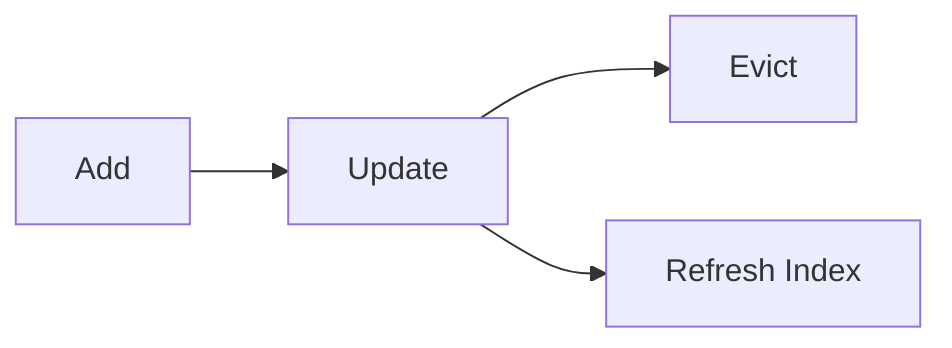

# Memory Updates, Eviction, and Consistency

> "Forgetting is also a form of memory."
> — Freud (adapted)

---
layout: default
---

# Conceptual Core

- Updates: add, modify, delete
- Eviction: LRU, importance
- Consistency: refresh index

---
layout: default
---

# Conceptual Core (continued)

- Versioning
- Forgetting = selective retention

---
layout: default
---

# Technical Example

- Update: delete old, add new
- Eviction policy
- Lab 3: Updates in memory tool

---
layout: default
---

# Philosophical Reflection

- Eviction = governance
- Selective retention
- Curation, not comprehensiveness
.Figure 7.5: Memory lifecycle
[plantuml,ch07-l05,png,theme=sketchy-outline]
....
@startuml
start
:Add;
:Update;
:Evict;
:Refresh Index;
stop
@enduml
....

---
layout: default
---

# Discussion Prompts

- What should the agent forget?
- Who decides eviction policy?
- Is "forgetting" a bug or a feature?

---
layout: default
---

# Diagram

---
layout: default
---

# Lab Prep

- Lab 3: add, update, delete
- Eviction
- Index consistency

---
layout: center
---

# Questions?
