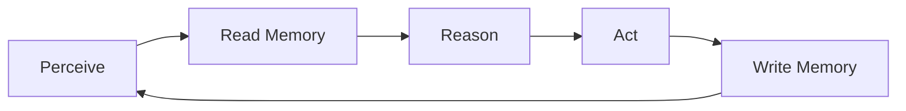

# Memory in the Agent Loop

> "Remembering is an action—not a passive recall."
> — (adapted)

---
layout: default
---

# Conceptual Core

- Read: before generation
- Write: after actions
- Experience buffer

---
layout: default
---

# Conceptual Core (continued)

- Episodic vs. semantic
- Loop: perceive → retrieve → reason → act → store
- Memory shapes action; action shapes memory

---
layout: default
---

# Technical Example

- Loop: retrieve → reason → act → store
- Access patterns
- Lab 3: Integrate with agent (Ch9)

---
layout: default
---

# Philosophical Reflection

- Extended mind
- Coupled: agent + memory
- Remembering = action
.Figure 7.6: Agent loop with memory read/write
[plantuml,ch07-l06,png,theme=sketchy-outline]
....
@startuml
start
:Perceive;
:Read Memory;
:Reason;
:Act;
:Write Memory;
stop
@enduml
....

---
layout: default
---

# Discussion Prompts

- When should the agent write to memory?
- What is "relevant" for retrieval?
- Is memory part of the agent or a tool?

---
layout: default
---

# Diagram

---
layout: default
---

# Lab Prep

- Lab 3: Integrate with agent
- Retrieve before, store after
- Design integration points

---
layout: center
---

# Questions?
