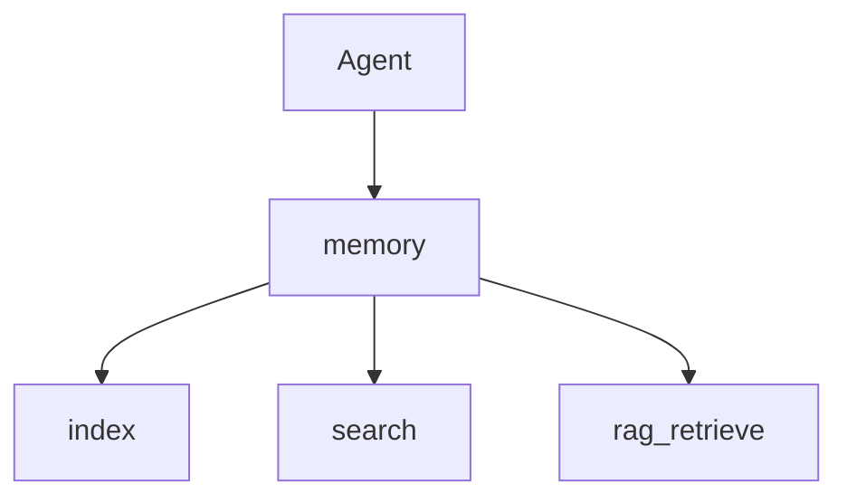

# The memory Tool

> "The memory tool extends the agent—across time and documents."
> — (adapted)

---
layout: default
---

# Conceptual Core

- Tools: index, search, rag_retrieve, add, update
- Integration: rag_retrieve → llm prompt
- Hybrid: vector + symbolic

---
layout: default
---

# Conceptual Core (continued)

- student-ai/memory/
- Extends across time, documents

---
layout: default
---

# Technical Example

- Schema: index, search, rag_retrieve, add, update
- Agent: store, retrieve
- Lab 3: Complete, register, test

---
layout: default
---

# Philosophical Reflection

- Tool vs. self
- Accumulates experience
- Extends agent
.Figure 7.7: memory in agent stack
[plantuml,ch07-l07,png,theme=sketchy-outline]
....
@startuml
start
:Agent;
:memory;
:index;
:search;
:rag_retrieve;
stop
@enduml
....

---
layout: default
---

# Discussion Prompts

- Is the memory store "the agent's" memory?
- What should the agent store?
- How does memory change the agent over time?

---
layout: default
---

# Diagram

---
layout: default
---

# Lab Prep

- Lab 3: Complete, register
- Test: index, retrieve, store
- Integrate llm for RAG

---
layout: center
---

# Questions?
