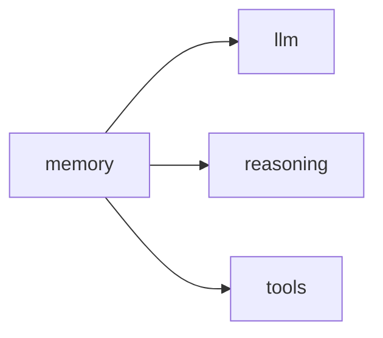

# Lab Integration — Vector Memory System

> "The past is never dead. It's not even past."
> — Faulkner (memory persists)

---
layout: default
---

# Conceptual Core

- Recap: vector store, RAG, hybrid, updates
- memory in student-ai/memory/
- Connections: reasoning, tools

---
layout: default
---

# Conceptual Core (continued)

- Memory as metabolism
- Knowledge infrastructure

---
layout: default
---

# Technical Example

- End-to-end: RAG, store
- Submodule
- Feeds llm, reasoning, tools

---
layout: default
---

# Philosophical Reflection

- Memory as metabolism
- Persistence layer
- Retrieval = reconstruction
.Figure 7.8: memory and consumers
[plantuml,ch07-l08,png,theme=sketchy-outline]
....
@startuml
start
:memory;
:llm;
:reasoning;
:tools;
stop
@enduml
....

---
layout: default
---

# Discussion Prompts

- How does memory change the agent's "identity" over time?
- What is the relationship between memory and metabolism?
- Is memory "infrastructure" or "cognition"?

---
layout: default
---

# Diagram

---
layout: default
---

# Lab Prep

- Complete Labs 1–3, submit
- Integrate in student-ai/memory/
- Ch8 reasoning, Ch9 agent next

---
layout: center
---

# Questions?
