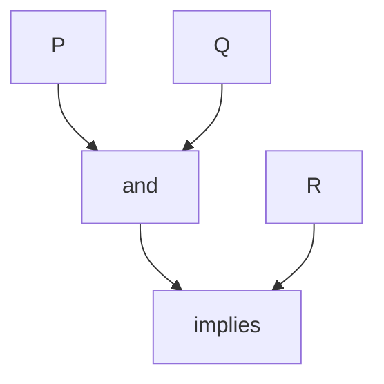

# Propositional Logic — Syntax and Semantics

> "Logic is the hygiene of thought."
> — (propositional logic as baseline)

---
layout: default
---

# Conceptual Core

- Syntax: atoms, ∧, ∨, ¬, →
- Semantics: truth tables, models
- Validity, satisfiability, entailment

---
layout: default
---

# Conceptual Core (continued)

- Resolution: refutation-complete
- Logic as norm; gap with natural language

---
layout: default
---

# Technical Example

- KB in propositional logic
- Prove via resolution
- Lab 1: Represent knowledge

---
layout: default
---

# Philosophical Reflection

- Logic = norm
- Idealization vs. language
- Baseline for FOL
.Figure 8.1: Propositional logic (syntax tree)
[plantuml,ch08-l01,png,theme=sketchy-outline]
....
@startuml
start
:P;
:and;
:Q;
:implies;
:R;
stop
@enduml
....

---
layout: default
---

# Discussion Prompts

- When does propositional logic suffice?
- What is lost when we formalize natural language?
- Is "valid" the same as "correct"?

---
layout: default
---

# Diagram

---
layout: default
---

# Lab Prep

- Lab 1: Propositional KB
- Resolution or SAT
- Foundation for reasoning tool

---
layout: center
---

# Questions?
