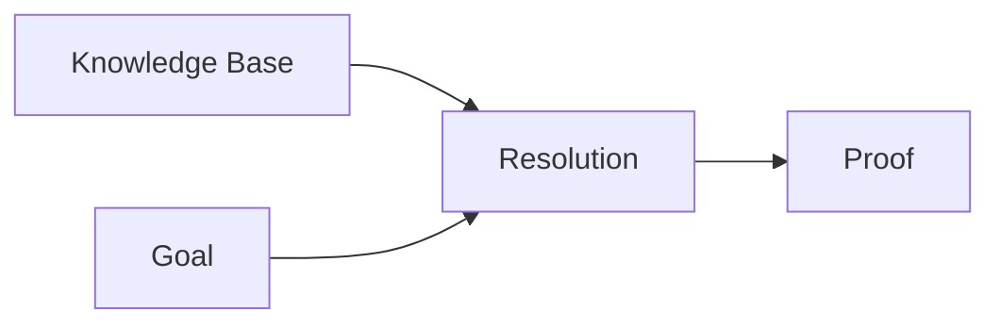

# First-Order Logic — Quantifiers and Unification

> "All and some: the quantifiers that scale logic."
> — FOL

---
layout: default
---

# Conceptual Core

- FOL: terms, predicates, ∀, ∃
- Unification
- Resolution: skolemization, unification

---
layout: default
---

# Conceptual Core (continued)

- Undecidable in general
- Expressiveness vs. tractability

---
layout: default
---

# Technical Example

- Encode domain, prove
- Lab 1: Resolution or forward chaining

---
layout: default
---

# Philosophical Reflection

- Tradeoff: expressiveness, tractability
- Logic has scope limits
.Figure 8.2: FOL inference (unification, resolution)
[plantuml,ch08-l02,png,theme=sketchy-outline]
....
@startuml
start
:Knowledge Base;
:Resolution;
:Goal;
:Proof;
stop
@enduml
....

---
layout: default
---

# Discussion Prompts

- When is FOL the right representation?
- What does undecidability mean in practice?
- How do we handle domains logic cannot capture?

---
layout: default
---

# Diagram

---
layout: default
---

# Lab Prep

- Lab 1: FOL resolution/forward chaining
- Skolemization, unification
- Feeds reasoning tool

---
layout: center
---

# Questions?
