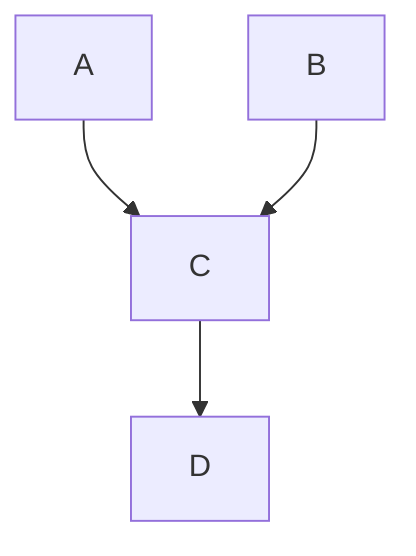

# Probabilistic Reasoning — Bayesian Networks

> "Uncertainty is not a defect—it is a feature."
> — Probabilistic reasoning

---
layout: default
---

# Conceptual Core

- Prior, posterior, likelihood
- Bayesian networks: DAG, CPTs
- d-separation, independence

---
layout: default
---

# Conceptual Core (continued)

- Inference: variable elimination, sampling
- Probability = degree of belief

---
layout: default
---

# Technical Example

- Build network, infer
- Variable elimination
- Lab 2: Probabilistic inference

---
layout: default
---

# Philosophical Reflection

- Uncertainty as feature
- Degree of belief
- Bayesian vs. frequentist
.Figure 8.3: Bayesian network and inference
[plantuml,ch08-l03,png,theme=sketchy-outline]
....
@startuml
start
:A;
:C;
:B;
:D;
stop
@enduml
....

---
layout: default
---

# Discussion Prompts

- When is probability the right representation?
- What does "degree of belief" mean for an agent?
- How do we learn the parameters of a Bayesian network?

---
layout: default
---

# Diagram

---
layout: default
---

# Lab Prep

- Lab 2: Probabilistic inference
- infer_probability
- Variable elimination or sampling

---
layout: center
---

# Questions?
