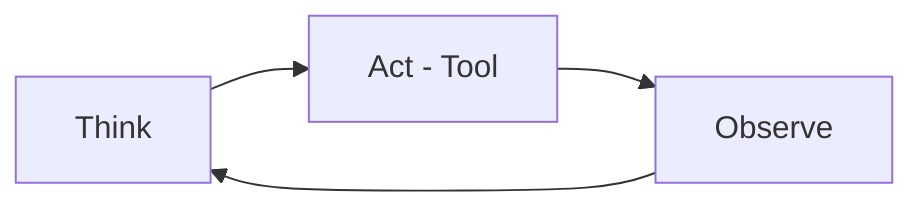

# Reasoning with Tools — Retrieval and Computation

> "Reasoning extends through tools."
> — (tool-augmented inference)

---
layout: default
---

# Conceptual Core

- Retrieval-augmented: fetch, then infer
- Tool-augmented: calculator, search, code
- ReAct: think → act → observe

---
layout: default
---

# Conceptual Core (continued)

- Extended mind
- Tools = cognitive prosthetics

---
layout: default
---

# Technical Example

- Search + calculator
- Trace reasoning chain
- Lab 3: API for agent (Ch9)

---
layout: default
---

# Philosophical Reflection

- Reasoning extends
- Agent + tools = system
.Figure 8.6: Tool-augmented reasoning loop
[plantuml,ch08-l06,png,theme=sketchy-outline]
....
@startuml
start
:Think;
:Act - Tool;
:Observe;
stop
@enduml
....

---
layout: default
---

# Discussion Prompts

- Where does "reasoning" happen—agent or tools?
- When should the agent use a tool vs. reason symbolically?
- How does retrieval change reasoning?

---
layout: default
---

# Diagram

---
layout: default
---

# Lab Prep

- Lab 3: API for agent
- Agent invokes in ReAct (Ch9)

---
layout: center
---

# Questions?
