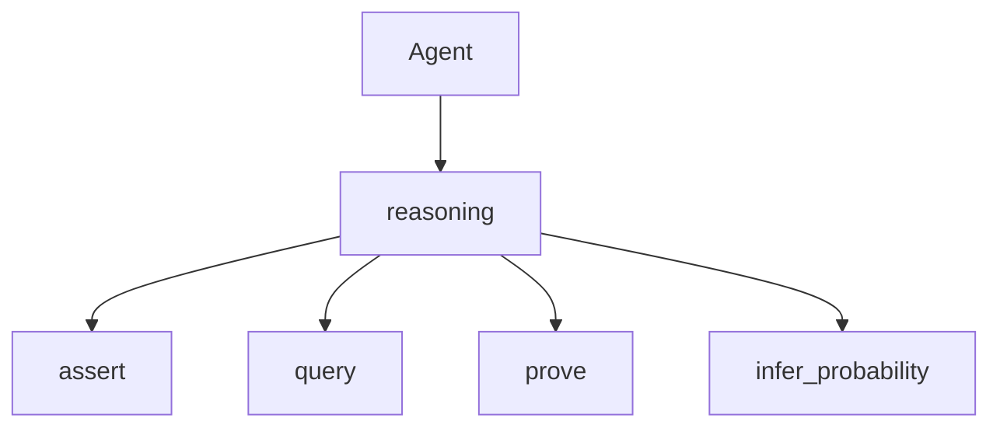

# The reasoning Tool

> "Inference as a service—the agent delegates reasoning."
> — (adapted)

---
layout: default
---

# Conceptual Core

- Tools: assert, query, prove, infer_probability, CoT
- Integration: llm, memory
- Logic + probability + LLM

---
layout: default
---

# Conceptual Core (continued)

- student-ai/reasoning/
- Modularity

---
layout: default
---

# Technical Example

- Schema: assert, query, prove, infer_probability, CoT
- Agent uses all
- Lab 3: Complete, register

---
layout: default
---

# Philosophical Reflection

- Delegation
- Modularity
- Swap engines
.Figure 8.7: reasoning in agent stack
[plantuml,ch08-l07,png,theme=sketchy-outline]
....
@startuml
start
:Agent;
:reasoning;
:assert;
:query;
:prove;
:infer_probability;
stop
@enduml
....

---
layout: default
---

# Discussion Prompts

- Should reasoning be a tool or built-in?
- What does "inference as a service" mean?
- How do logic, probability, and LLM co-exist?

---
layout: default
---

# Diagram

---
layout: default
---

# Lab Prep

- Lab 3: Complete, register
- All tools
- Agent invokes (Ch9)

---
layout: center
---

# Questions?
