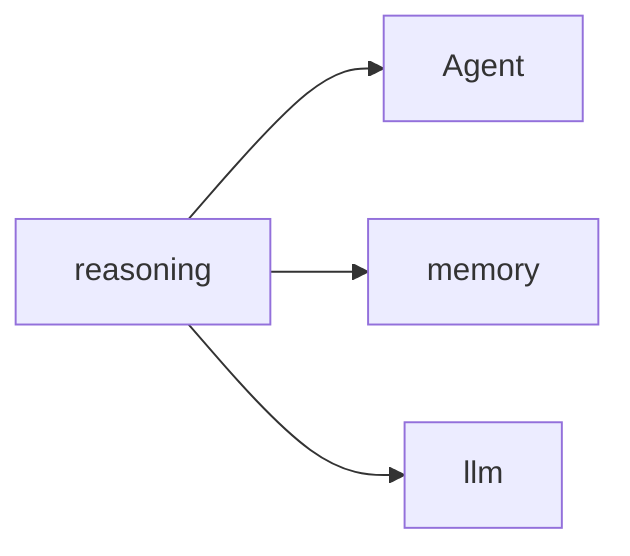

# Lab Integration — Inference Engine

> "To reason is to follow a rule—or to break one consciously."
> — (adapted)

---
layout: default
---

# Conceptual Core

- Recap: logic, probability, LLM, tools
- reasoning in student-ai/reasoning/
- Ch9: agent invokes in ReAct

---
layout: default
---

# Conceptual Core (continued)

- Logic + probability + language
- Structured thought = infrastructure

---
layout: default
---

# Technical Example

- End-to-end: planning, verification
- Submodule
- Cognitive triad: memory, llm, reasoning

---
layout: default
---

# Philosophical Reflection

- Combine: logic, probability, language
- Reasoning supports action
- There when needed
.Figure 8.8: reasoning and agent loop
[plantuml,ch08-l08,png,theme=sketchy-outline]
....
@startuml
start
:reasoning;
:Agent;
:memory;
:llm;
stop
@enduml
....

---
layout: default
---

# Discussion Prompts

- How do logic, probability, and LLM fit together?
- When does the agent "reason" vs. "act"?
- What is "structured thought"?

---
layout: default
---

# Diagram

---
layout: default
---

# Lab Prep

- Complete Labs 1–3, submit
- Integrate in student-ai/reasoning/
- Ch9: ReAct agent

---
layout: center
---

# Questions?
