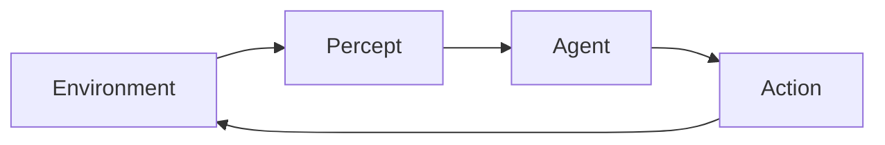

# Agents — Perception, Reasoning, Action

> "An agent is an entity that perceives and acts."
> — Russell & Norvig

---
layout: default
---

# Conceptual Core

- Agent: percepts, actions, goals
- Environment: observable, deterministic, episodic/sequential
- Rationality: maximize expected utility

---
layout: default
---

# Conceptual Core (continued)

- Reflex vs. model-based
- perceive → reason → act

---
layout: default
---

# Technical Example

- Reflex vs. model-based
- Lab 1: Tool schemas
- Tools = action space

---
layout: default
---

# Philosophical Reflection

- Agency: agent vs. system
- Goals = values
.Figure 9.1: Agent-environment loop
[plantuml,ch09-l01,png,theme=sketchy-outline]
....
@startuml
start
:Environment;
:Percept;
:Agent;
:Action;
stop
@enduml
....

---
layout: default
---

# Discussion Prompts

- Where is "the agent" in an agent+tools system?
- How do we choose goals for an agent?
- Is rationality (expected utility) the right normative standard?

---
layout: default
---

# Diagram

---
layout: default
---

# Lab Prep

- Lab 1: Tool schemas
- Name, description, parameters
- Action space

---
layout: center
---

# Questions?
