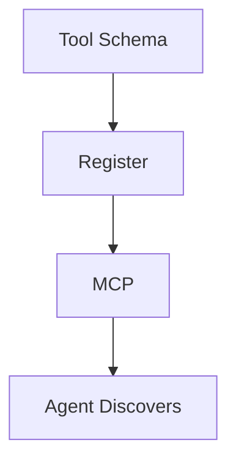

# Tool Use — Schemas and Registration

> "Tools extend the body; the tool protocol extends the agent."
> — (adapted)

---
layout: default
---

# Conceptual Core

- Schema: name, description, parameters (JSON)
- Registration: toolbox
- Selection, routing

---
layout: default
---

# Conceptual Core (continued)

- MCP: discovery, invocation
- Tools = delegated action

---
layout: default
---

# Technical Example

- Define: search, memory, calculator
- Register with framework
- Lab 1: Tool registration

---
layout: default
---

# Philosophical Reflection

- Delegated action
- Repertoire = possibilities
- Protocol = infrastructure
.Figure 9.2: Tool schema and registration
[plantuml,ch09-l02,png,theme=sketchy-outline]
....
@startuml
start
:Tool Schema;
:Register;
:MCP;
:Agent Discovers;
stop
@enduml
....

---
layout: default
---

# Discussion Prompts

- How does the agent choose which tool to use?
- What happens when the agent has no suitable tool?
- Is MCP sufficient for tool discovery?

---
layout: default
---

# Diagram

---
layout: default
---

# Lab Prep

- Lab 1: Tool registration
- Discover via registration

---
layout: center
---

# Questions?
