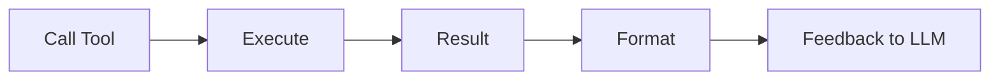

# Tool Execution and Feedback

> "Action returns observation—the world speaks back."
> — (adapted)

---
layout: default
---

# Conceptual Core

- Execute: call, wait, parse
- Feedback: success, error, partial
- Failures: retry, fallback, propagate

---
layout: default
---

# Conceptual Core (continued)

- Timeouts, limits
- Observation = constraint

---
layout: default
---

# Technical Example

- Execute tools
- Format for LLM
- Lab 2: Execution layer

---
layout: default
---

# Philosophical Reflection

- World limits possibility
- Agent adapts to observation
- Execution = boundary
.Figure 9.3: Tool execution flow
[plantuml,ch09-l03,png,theme=sketchy-outline]
....
@startuml
start
:Call Tool;
:Execute;
:Result;
:Format;
:Feedback to LLM;
stop
@enduml
....

---
layout: default
---

# Discussion Prompts

- What should the agent do when a tool fails?
- How much feedback is too much?
- Who is responsible when tool execution goes wrong?

---
layout: default
---

# Diagram

---
layout: default
---

# Lab Prep

- Lab 2: Execution layer
- Call, parse, format
- Error handling

---
layout: center
---

# Questions?
