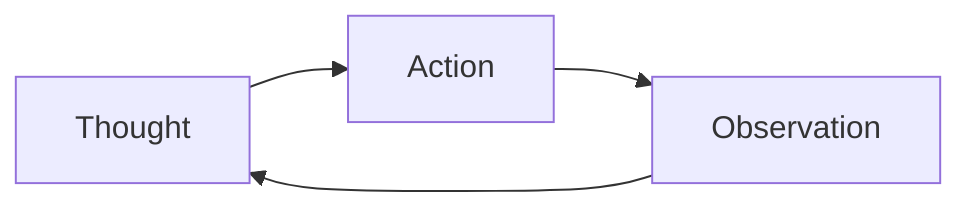

# ReAct — Reasoning and Acting in Interleaved Steps

> "Thought and action are not separate—they interleave."
> — ReAct

---
layout: default
---

# Conceptual Core

- ReAct: Thought, Action, Observation
- LLM generates thought + action
- Loop until done or max steps

---
layout: default
---

# Conceptual Core (continued)

- Interleaved: think, act, observe
- Dialectic: thought ↔ action

---
layout: default
---

# Technical Example

- Implement loop
- Trace chain
- Lab 3: ReAct in agent

---
layout: default
---

# Philosophical Reflection

- Reason in the world
- Observation feeds thought
- Dialectic
.Figure 9.4: ReAct loop
[plantuml,ch09-l04,png,theme=sketchy-outline]
....
@startuml
start
:Thought;
:Action;
:Observation;
stop
@enduml
....

---
layout: default
---

# Discussion Prompts

- Why interleave instead of plan-then-act?
- When does ReAct fail?
- How does observation shape reasoning?

---
layout: default
---

# Diagram

---
layout: default
---

# Lab Prep

- Lab 3: ReAct
- think → act → observe
- Stop: answer or max steps

---
layout: center
---

# Questions?
