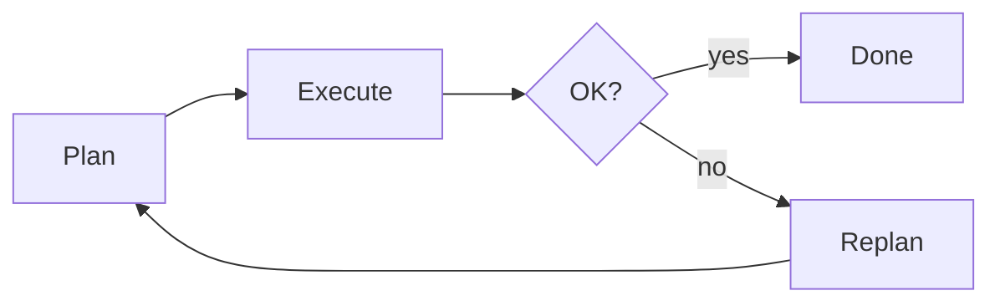

# Planning with Tools — Decomposition and Execution

> "Plan, then act—or plan in action."
> — (adapted)

---
layout: default
---

# Conceptual Core

- Decomposition: break goal into steps
- Planning: tools, order
- Execution, replanning

---
layout: default
---

# Conceptual Core (continued)

- Plans = hypotheses
- Limits of precomputation

---
layout: default
---

# Technical Example

- Multi-step task
- Execute, replan on failure
- Lab 3: Planning

---
layout: default
---

# Philosophical Reflection

- Plans = hypotheses
- Cannot foresee all
- Plan in action
.Figure 9.5: Plan-execute loop
[plantuml,ch09-l05,png,theme=sketchy-outline]
....
@startuml
start
:Plan;
:Execute;
:Done;
:Replan;
stop
@enduml
....

---
layout: default
---

# Discussion Prompts

- When is explicit planning better than ReAct?
- How should the agent replan?
- What are the limits of decomposition?

---
layout: default
---

# Diagram

---
layout: default
---

# Lab Prep

- Lab 3: Planning
- Explicit or implicit
- Replan on failure

---
layout: center
---

# Questions?
