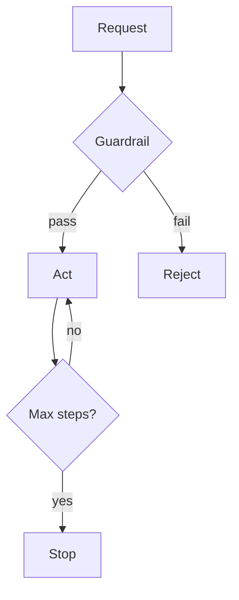

# Control Flow — Max Steps, Safety, Guardrails

> "Boundaries enable freedom."
> — (control as enabler)

---
layout: default
---

# Conceptual Core

- Max steps: prevent infinite loop
- Safety: allowlist, blocklist, rate limits
- Guardrails: input/output validation

---
layout: default
---

# Conceptual Core (continued)

- Graceful degradation
- Control enables freedom

---
layout: default
---

# Technical Example

- Max steps
- Allowlist
- Guardrails for sensitive

---
layout: default
---

# Technical Example (continued)

- Lab 3: Control flow

---
layout: default
---

# Philosophical Reflection

- Limits enable
- Safety = design choice
- Normative
.Figure 9.6: Control flow (limits, guardrails)
[plantuml,ch09-l06,png,theme=sketchy-outline]
....
@startuml
start
:Request;
:Act;
:Reject;
:Stop;
stop
@enduml
....

---
layout: default
---

# Discussion Prompts

- How do we balance safety and capability?
- Who decides the guardrails?
- When should the agent stop vs. continue?

---
layout: default
---

# Diagram

---
layout: default
---

# Lab Prep

- Lab 3: Control flow
- Max steps, allowlist
- Document limits

---
layout: center
---

# Questions?
