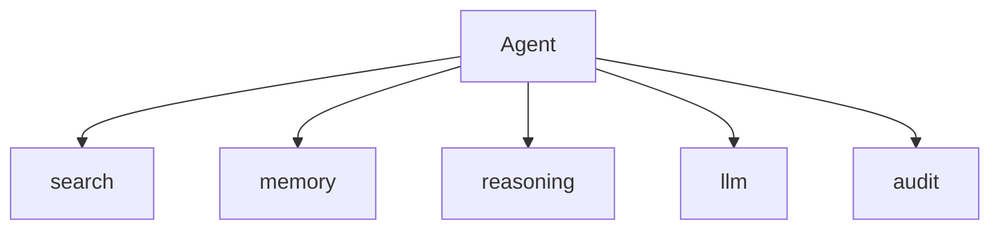

# The Tool-Calling Agent — Integration

> "The agent is the sum of its tools—and its capacity to use them."
> — (adapted)

---
layout: default
---

# Conceptual Core

- Stack: llm, memory, reasoning, tools
- Tool client: discover, invoke
- End-to-end: query → agent → tools → response

---
layout: default
---

# Conceptual Core (continued)

- Agent = orchestrator
- Distributed agency

---
layout: default
---

# Technical Example

- Wire: llm, memory, reasoning, search, audit, etc.
- Complex task, multiple tools
- Lab 3: Complete agent

---
layout: default
---

# Philosophical Reflection

- Orchestrator
- Sum of tools + capacity to use
- Distributed agency
.Figure 9.7: Full agent stack (all MCP tools)
[plantuml,ch09-l07,png,theme=sketchy-outline]
....
@startuml
start
:Agent;
:search;
:memory;
:reasoning;
:llm;
:audit;
stop
@enduml
....

---
layout: default
---

# Discussion Prompts

- Is the agent "in charge" or are the tools?
- What makes the agent more than the sum of its tools?
- How do we evaluate an orchestration agent?

---
layout: default
---

# Diagram

---
layout: default
---

# Lab Prep

- Lab 3: Complete agent
- All tools integrated
- Test complex task

---
layout: center
---

# Questions?
