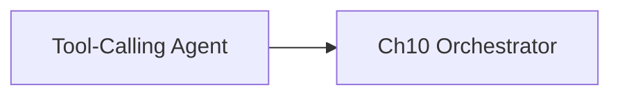

# Lab Integration — Tool-Calling Agent

> "The agent acts. The tools extend. The user delegates."
> — (adapted)

---
layout: default
---

# Conceptual Core

- Recap: tools, ReAct, planning, control
- Consumes: search, memory, reasoning, llm, audit, ml_trainer, neural_classifier
- student-ai/tools/

---
layout: default
---

# Conceptual Core (continued)

- Ch10: orchestrator
- Components → integrated system

---
layout: default
---

# Technical Example

- End-to-end demo
- Submodule
- Complete cognitive loop

---
layout: default
---

# Philosophical Reflection

- Cognitive triad + tools
- Whole > parts
- User delegates, agent acts, tools extend
.Figure 9.8: Tool-calling agent and Ch10 orchestrator
[plantuml,ch09-l08,png,theme=sketchy-outline]
....
@startuml
start
:Tool-Calling Agent;
:Ch10 Orchestrator;
stop
@enduml
....

---
layout: default
---

# Discussion Prompts

- What can the agent do that no single tool can?
- How does integration change the user experience?
- What is the relationship between the agent and the orchestrator (Ch10)?

---
layout: default
---

# Diagram

---
layout: default
---

# Lab Prep

- Complete Labs 1–3, submit
- Integrate in student-ai/tools/
- Ch10: Orchestrator

---
layout: center
---

# Questions?
