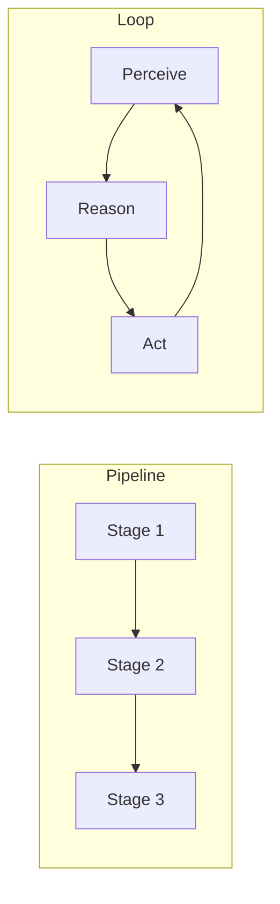

# Agent Architectures — Pipelines and Loops

> "Architecture is politics made concrete."
> — (adapted for AI systems)

---
layout: default
---

# Conceptual Core

- Pipeline: linear, deterministic
- Loop: iterative, adaptive
- Hybrid: pipeline + loops

---
layout: default
---

# Conceptual Core (continued)

- Tradeoffs: simplicity vs. flexibility
- Structure shapes possibility

---
layout: default
---

# Technical Example

- Compare pipeline vs. loop
- Loop when: multi-step, feedback
- Lab 1: Design pipeline, document flow

---
layout: default
---

# Philosophical Reflection

- Structure enables, constrains
- Politics of architecture
.Figure 10.1: Pipeline vs. loop architectures
[plantuml,ch10-l01,png,theme=sketchy-outline]
....
@startuml
start
:"Pipeline";
:Stage 1;
:Stage 2;
:Stage 3;
:"Loop";
:Perceive;
:Reason;
:Act;
stop
@enduml
....

---
layout: default
---

# Discussion Prompts

- When is a pipeline sufficient?
- What does "politics of architecture" mean?
- How do we evaluate an architecture?

---
layout: default
---

# Diagram

---
layout: default
---

# Lab Prep

- Lab 1: Design pipeline
- Document data flow

---
layout: center
---

# Questions?
