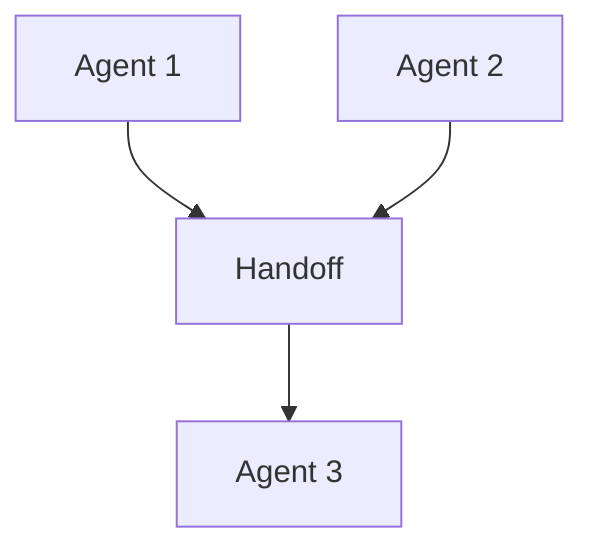

# Multi-Agent Systems — Specialists and Coordination

> "No one knows everything; together we know more."
> — (multi-agent)

---
layout: default
---

# Conceptual Core

- Specialists: domain expertise
- Coordination: handoff, delegation, consensus
- Communication: messages, shared state

---
layout: default
---

# Conceptual Core (continued)

- Multi-agent when: complex, parallel
- Collective intelligence

---
layout: default
---

# Technical Example

- Researcher, writer, critic
- Handoff protocol
- Lab 2: Multi-agent coordination

---
layout: default
---

# Philosophical Reflection

- Collective intelligence
- Delegation, trust, verification
- Distributed cognition
.Figure 10.2: Multi-agent coordination
[plantuml,ch10-l02,png,theme=sketchy-outline]
....
@startuml
start
:Agent 1;
:Handoff;
:Agent 2;
:Agent 3;
stop
@enduml
....

---
layout: default
---

# Discussion Prompts

- When is multi-agent better than single agent?
- How do we coordinate without central control?
- What are the risks of delegation?

---
layout: default
---

# Diagram

---
layout: default
---

# Lab Prep

- Lab 2: Multi-agent coordination
- Tool-based
- Orchestrator routes

---
layout: center
---

# Questions?
