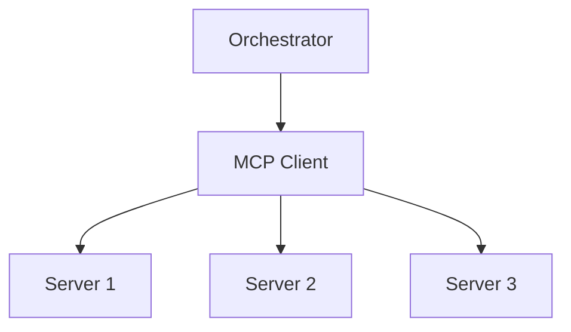

# Orchestration — The Tool Client

> "The orchestrator does not do the work—it directs it."
> — (adapted)

---
layout: default
---

# Conceptual Core

- Tool client: discover, route
- Orchestration: which tool when
- Request routing, load balancing

---
layout: default
---

# Conceptual Core (continued)

- Configuration: URLs, credentials
- Meta-cognition

---
layout: default
---

# Technical Example

- Implement client
- Connect to all tools
- Lab 2: Tool client

---
layout: default
---

# Philosophical Reflection

- Meta-cognition
- Division of labor
.Figure 10.3: MCP client and server topology
[plantuml,ch10-l03,png,theme=sketchy-outline]
....
@startuml
start
:Orchestrator;
:MCP Client;
:Server 1;
:Server 2;
:Server 3;
stop
@enduml
....

---
layout: default
---

# Discussion Prompts

- Who "decides" in an orchestrated system?
- What is the relationship between orchestrator and LLM?
- When does orchestration add value vs. overhead?

---
layout: default
---

# Diagram

---
layout: default
---

# Lab Prep

- Lab 2: Tool client
- Discover, invoke
- Core of orchestrator

---
layout: center
---

# Questions?
