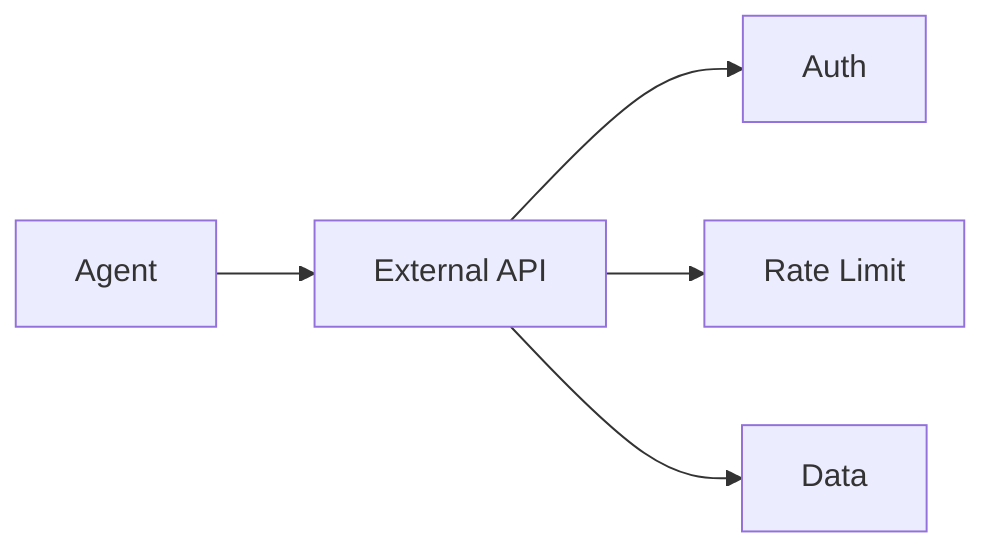

# API Integration — REST, Authentication

> "APIs are the seams of the digital world."
> — (adapted)

---
layout: default
---

# Conceptual Core

- REST: GET, POST, JSON
- Auth: API keys, OAuth
- Rate limiting, retries, errors

---
layout: default
---

# Conceptual Core (continued)

- External: Workspace, databases
- Dependency, brittleness

---
layout: default
---

# Technical Example

- Call external API
- Auth, errors, rate limits
- Lab 3: API integration

---
layout: default
---

# Philosophical Reflection

- APIs = seams
- Dependency = vulnerability
.Figure 10.4: Agent and external APIs
[plantuml,ch10-l04,png,theme=sketchy-outline]
....
@startuml
start
:Agent;
:External API;
:Auth;
:Rate Limit;
:Data;
stop
@enduml
....

---
layout: default
---

# Discussion Prompts

- What are the risks of API dependency?
- How do we handle API changes?
- Should the agent call arbitrary APIs?

---
layout: default
---

# Diagram

---
layout: default
---

# Lab Prep

- Lab 3: API integration
- External API
- Auth, errors, document

---
layout: center
---

# Questions?
