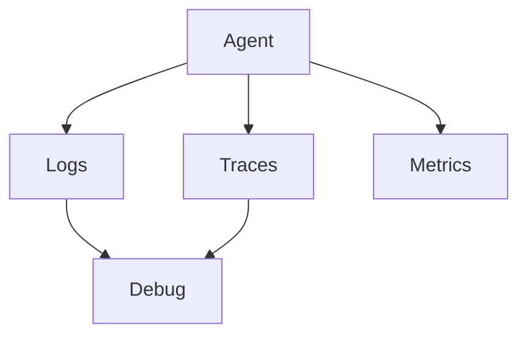

# Monitoring and Debugging Agent Behavior

> "To observe is to intervene—and to debug is to understand."
> — (adapted)

---
layout: default
---

# Conceptual Core

- Logging: calls, responses, traces
- Tracing: request ID, path
- Debugging: why X?

---
layout: default
---

# Conceptual Core (continued)

- Evaluation: benchmarks, metrics
- Opacity, interpretability

---
layout: default
---

# Technical Example

- Structured logging
- Trace failed task
- Lab 3: Monitoring, audit tool

---
layout: default
---

# Philosophical Reflection

- Hard to understand
- Traces help infer
- Observability = governance
.Figure 10.5: Observability stack for agents
[plantuml,ch10-l05,png,theme=sketchy-outline]
....
@startuml
start
:Agent;
:Debug;
stop
@enduml
....

---
layout: default
---

# Discussion Prompts

- How do we debug an opaque agent?
- What should we log vs. not log?
- Who has access to agent traces?

---
layout: default
---

# Diagram

---
layout: default
---

# Lab Prep

- Lab 3: Monitoring
- Audit tool integration
- Trace, dependencies

---
layout: center
---

# Questions?
