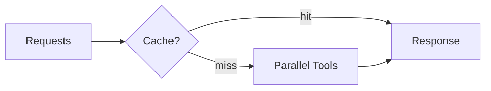

# Scaling — Throughput and Latency

> "Scale is not just size—it is the capacity to handle load."
> — (adapted)

---
layout: default
---

# Conceptual Core

- Throughput: req/s
- Latency: TTFT, completion
- Bottlenecks: LLM, tools, network

---
layout: default
---

# Conceptual Core (continued)

- Strategies: cache, parallel, batch
- Material limits

---
layout: default
---

# Technical Example

- Load test
- Identify bottlenecks
- Caching

---
layout: default
---

# Technical Example (continued)

- Lab 3: Profile, document limits

---
layout: default
---

# Philosophical Reflection

- Scale = infrastructure
- Material limits
- Costs
.Figure 10.6: Scaling (caching, parallel tools)
[plantuml,ch10-l06,png,theme=sketchy-outline]
....
@startuml
start
:Requests;
:Response;
:Parallel Tools;
stop
@enduml
....

---
layout: default
---

# Discussion Prompts

- What are the environmental costs of scale?
- How do we trade off latency vs. throughput?
- When is scaling "enough"?

---
layout: default
---

# Diagram

---
layout: default
---

# Lab Prep

- Lab 3: Profile
- Document limits
- Caching

---
layout: center
---

# Questions?
