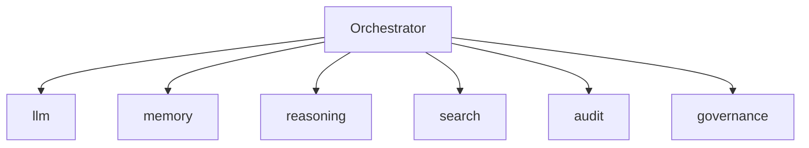

# The Orchestrator — End-to-End Stack

> "The whole is more than the sum of its parts—when it is well orchestrated."
> — (adapted)

---
layout: default
---

# Conceptual Core

- Full stack: all tools
- Orchestrator: routes, coordinates, monitors
- student-ai/orchestration/

---
layout: default
---

# Conceptual Core (continued)

- User → orchestrator → tools → response
- Distributed system

---
layout: default
---

# Technical Example

- Run with all tools
- Complex task
- Lab 3: Complete, test

---
layout: default
---

# Philosophical Reflection

- Integration = achievement
- Distributed system
- Orchestrator = coordinator
.Figure 10.7: Complete orchestrator stack
[plantuml,ch10-l07,png,theme=sketchy-outline]
....
@startuml
start
:Orchestrator;
:llm;
:memory;
:reasoning;
:search;
:audit;
:governance;
stop
@enduml
....

---
layout: default
---

# Discussion Prompts

- Where is "the agent" in the distributed system?
- What does the orchestrator add beyond the tool-calling agent?
- How do we test an integrated system?

---
layout: default
---

# Diagram

---
layout: default
---

# Lab Prep

- Lab 3: Complete orchestrator
- All tools
- Test end-to-end

---
layout: center
---

# Questions?
