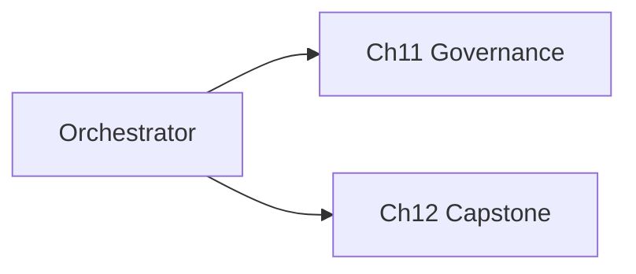

# Lab Integration — Agent Orchestrator

> "The architecture is the theory made concrete."
> — (adapted)

---
layout: default
---

# Conceptual Core

- Recap: pipeline, multi-agent, client, APIs, monitoring, scaling
- student-ai/orchestration/
- Ch11: governance

---
layout: default
---

# Conceptual Core (continued)

- Ch12: capstone
- Architecture = theory

---
layout: default
---

# Technical Example

- Deploy
- Document architecture
- Lab 3: Complete, submit, prepare Ch11

---
layout: default
---

# Philosophical Reflection

- Epistemic machine
- Whole exceeds parts
- Theory made concrete
.Figure 10.8: Orchestrator and Ch11/Ch12
[plantuml,ch10-l08,png,theme=sketchy-outline]
....
@startuml
start
:Orchestrator;
:Ch11 Governance;
:Ch12 Capstone;
stop
@enduml
....

---
layout: default
---

# Discussion Prompts

- What theory of intelligence does our architecture encode?
- How does governance (Ch11) change the orchestrator?
- What is the capstone (Ch12) delivering?

---
layout: default
---

# Diagram

---
layout: default
---

# Lab Prep

- Complete Labs 1–3
- Submit orchestrator
- Prepare Ch11 governance

---
layout: center
---

# Questions?
