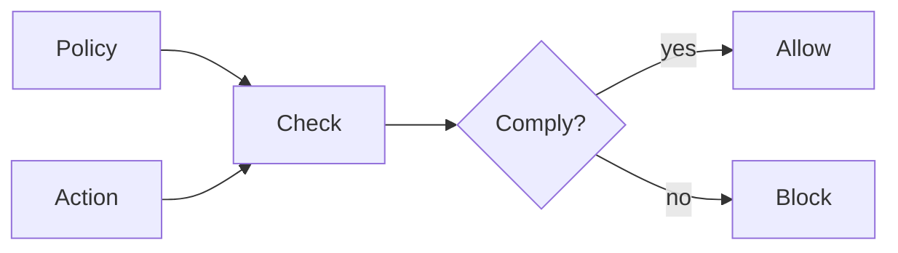

# Governance — Policies and Constraints

> "Power is exercised through norms."
> — Michel Foucault

---
layout: default
---

# Conceptual Core

- Policies: rules, constraints, guardrails
- Compliance: check adherence
- Representation: formal, natural language, code

---
layout: default
---

# Conceptual Core (continued)

- Tradeoffs: safety vs. utility
- Governance = constitutive
- Who writes policies?

---
layout: default
---

# Technical Example

- Define policies
- Check before/after
- Lab 1: Policy schema

---
layout: default
---

# Philosophical Reflection

- Constitutive
- Who writes = power
.Figure 11.1: Policy and compliance flow
[plantuml,ch11-l01,png,theme=sketchy-outline]
....
@startuml
start
:Policy;
:Check;
:Action;
:Allow;
:Block;
stop
@enduml
....

---
layout: default
---

# Discussion Prompts

- Who should write AI governance policies?
- How do we balance safety and utility?
- When should compliance block vs. warn?

---
layout: default
---

# Diagram

---
layout: default
---

# Lab Prep

- Lab 1: Policy schema
- Type, condition, scope

---
layout: center
---

# Questions?
