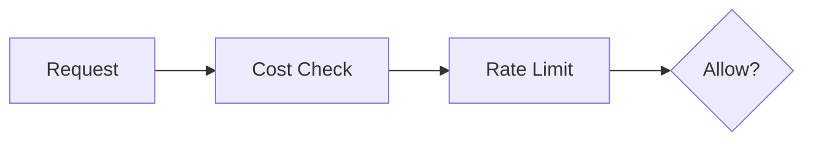

# Cost Control and Rate Limiting

> "Every API call has a cost."
> — (economic governance)

---
layout: default
---

# Conceptual Core

- Cost tracking: tokens, calls, compute
- Rate limiting: req/min
- Budgets, alerts

---
layout: default
---

# Conceptual Core (continued)

- Cost-aware design
- Access = economics

---
layout: default
---

# Technical Example

- Track LLM costs
- Budget, alert
- Lab 1: Cost tracking in simulator

---
layout: default
---

# Philosophical Reflection

- Cost = access control
- Sustainability
.Figure 11.2: Cost and rate limit flow
[plantuml,ch11-l02,png,theme=sketchy-outline]
....
@startuml
start
:Request;
:Cost Check;
:Rate Limit;
stop
@enduml
....

---
layout: default
---

# Discussion Prompts

- Who should bear the cost of AI systems?
- How do we make AI accessible despite costs?
- When is rate limiting justified?

---
layout: default
---

# Diagram

---
layout: default
---

# Lab Prep

- Lab 1: Cost tracking
- Rate limiter
- Budget alerts

---
layout: center
---

# Questions?
