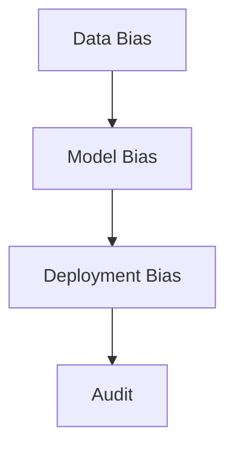

# Responsible AI — Fairness, Bias, Transparency

> "Bias is not a bug—it is baked into the data and the design."
> — (adapted)

---
layout: default
---

# Conceptual Core

- Fairness: parity, equalized odds
- Bias: data, model, deployment
- Transparency: explainability, documentation

---
layout: default
---

# Conceptual Core (continued)

- Tradeoffs: fairness vs. accuracy
- Fairness contested

---
layout: default
---

# Technical Example

- Audit across groups
- Document limitations
- Lab 2: Bias audit in simulator

---
layout: default
---

# Philosophical Reflection

- Fairness contested
- Transparency = accountability
- Politics of fairness
.Figure 11.3: Fairness metrics, bias sources
[plantuml,ch11-l03,png,theme=sketchy-outline]
....
@startuml
start
:Data Bias;
:Model;
:Model Bias;
:Deployment Bias;
:Audit;
stop
@enduml
....

---
layout: default
---

# Discussion Prompts

- Which fairness definition should we use?
- How do we detect bias in generative AI?
- What does "transparency" require?

---
layout: default
---

# Diagram

---
layout: default
---

# Lab Prep

- Lab 2: Bias audit
- Simulate scenarios
- Document findings

---
layout: center
---

# Questions?
