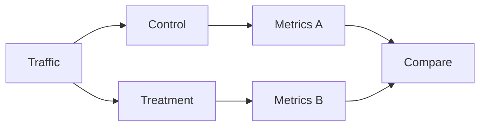

# Experimental AI — A/B Testing and Statistical Rigor

> "Without comparison, we have only anecdotes."
> — (evaluation)

---
layout: default
---

# Conceptual Core

- A/B: control vs. treatment
- Significance: p-value, CI
- Multiple comparisons

---
layout: default
---

# Conceptual Core (continued)

- Effect size
- Limits of testing

---
layout: default
---

# Technical Example

- Run A/B test
- Compute significance
- Lab 2: A/B in simulator

---
layout: default
---

# Philosophical Reflection

- Comparison = evidence
- Limits of testing
- Report honestly
.Figure 11.4: A/B test design
[plantuml,ch11-l04,png,theme=sketchy-outline]
....
@startuml
start
:Traffic;
:Control;
:Metrics A;
:Treatment;
:Metrics B;
:Compare;
stop
@enduml
....

---
layout: default
---

# Discussion Prompts

- When is A/B testing sufficient?
- How do we handle multiple metrics?
- What is "rigorous" evaluation?

---
layout: default
---

# Diagram

---
layout: default
---

# Lab Prep

- Lab 2: A/B testing
- Control, treatment, significance

---
layout: center
---

# Questions?
