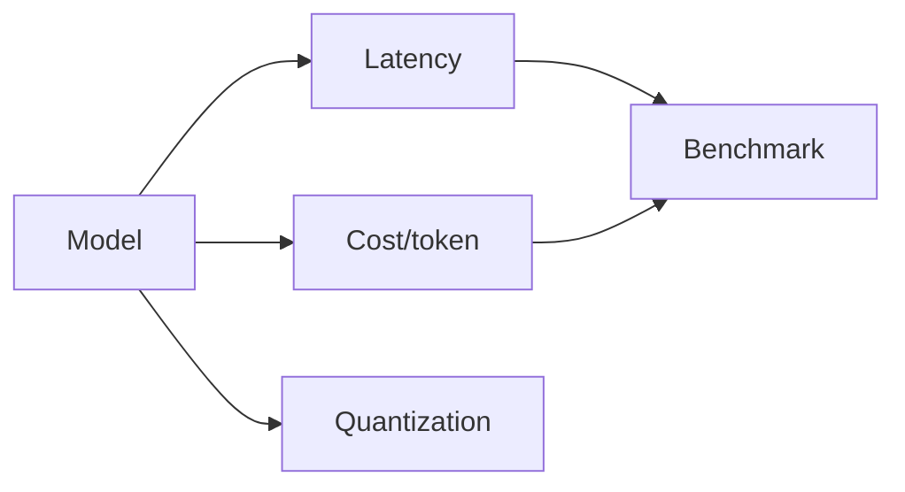

# GPU-Backed Evaluation — Latency, Cost, Quantization

> "Measure what matters—and measure it right."
> — (adapted)

---
layout: default
---

# Conceptual Core

- Latency: TTFT, completion
- Cost per token
- Quantization: precision, cost, quality

---
layout: default
---

# Conceptual Core (continued)

- Benchmarking: reproducible
- What we measure shapes what we build

---
layout: default
---

# Technical Example

- Measure latency
- Quantized vs. full
- Lab 2–3: GPU evaluation in simulator

---
layout: default
---

# Philosophical Reflection

- Metrics drive development
- Choose carefully
.Figure 11.5: Evaluation metrics (latency, cost)
[plantuml,ch11-l05,png,theme=sketchy-outline]
....
@startuml
start
:Model;
:Latency;
:Cost/token;
:Quantization;
:Benchmark;
stop
@enduml
....

---
layout: default
---

# Discussion Prompts

- What metrics matter for your use case?
- When is quantization acceptable?
- How do we balance latency and quality?

---
layout: default
---

# Diagram

---
layout: default
---

# Lab Prep

- Lab 2–3: GPU evaluation
- Latency, cost
- Optional quantization

---
layout: center
---

# Questions?
