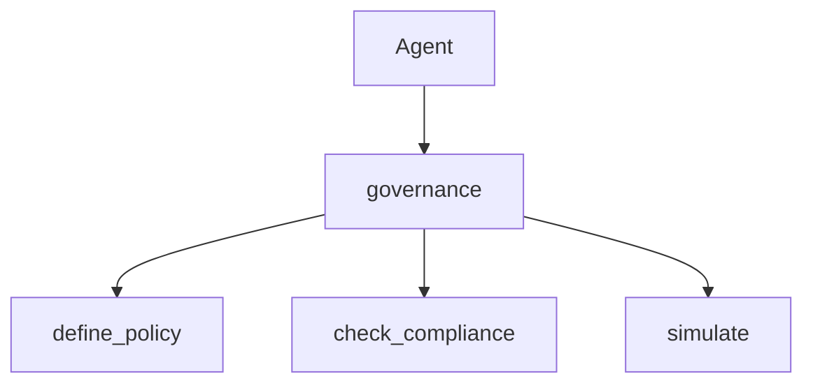

# The governance Tool

> "Governance as a tool—the agent can check itself."
> — (adapted)

---
layout: default
---

# Conceptual Core

- Tools: define_policy, check_compliance, simulate, report
- Agent invokes for self-audit
- Integrates with audit (Ch2)

---
layout: default
---

# Conceptual Core (continued)

- Reflexive governance
- Limits of self-audit

---
layout: default
---

# Technical Example

- Schema: define, check, simulate, report
- Agent checks before action
- Lab 3: Complete, register, integrate

---
layout: default
---

# Philosophical Reflection

- Reflexive
- Limits
- Self + external audit
.Figure 11.7: governance in agent stack
[plantuml,ch11-l07,png,theme=sketchy-outline]
....
@startuml
start
:Agent;
:governance;
:define_policy;
:check_compliance;
:simulate;
stop
@enduml
....

---
layout: default
---

# Discussion Prompts

- Can an agent truly govern itself?
- What are the limits of self-audit?
- When should governance block vs. warn?

---
layout: default
---

# Diagram

---
layout: default
---

# Lab Prep

- Lab 3: Complete, register, integrate
- Agent invokes governance

---
layout: center
---

# Questions?
