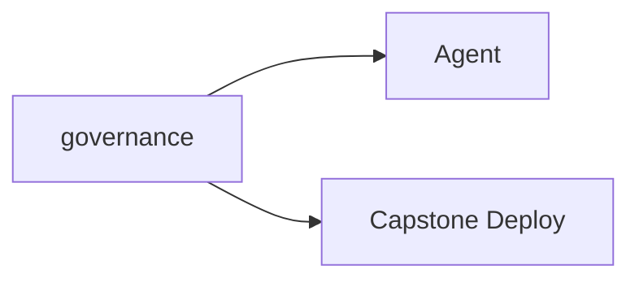

# Lab Integration — AI Governance Simulator

> "To govern is to anticipate."
> — (governance as future-oriented)

---
layout: default
---

# Conceptual Core

- Recap: policies, cost, fairness, A/B, evaluation, epistemology
- governance in student-ai/
- Ch12: capstone deploys with governance

---
layout: default
---

# Conceptual Core (continued)

- Governed agent
- Future-oriented

---
layout: default
---

# Technical Example

- Agent checks compliance
- Institutional scenarios
- Lab 3: Complete, submit, prepare Ch12

---
layout: default
---

# Philosophical Reflection

- Governance built in
- Institutional norms
- Capstone = governed system
.Figure 11.8: governance and capstone deployment
[plantuml,ch11-l08,png,theme=sketchy-outline]
....
@startuml
start
:governance;
:Agent;
:Capstone Deploy;
stop
@enduml
....

---
layout: default
---

# Discussion Prompts

- What does "governed deployment" mean?
- How does governance change the capstone?
- Who is accountable when the governed agent errs?

---
layout: default
---

# Diagram

---
layout: default
---

# Lab Prep

- Complete Labs 1–3
- Submit governance simulator
- Prepare Ch12 capstone

---
layout: center
---

# Questions?
