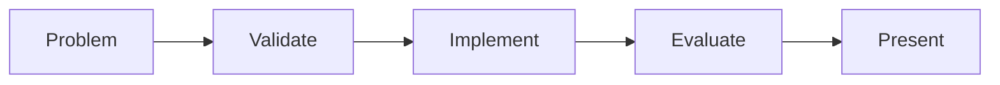

# Capstone Overview — The Student's AI

> "You are no longer studying AI. You have built one."
> — Epilogue

---
layout: default
---

# Conceptual Core

- Deploy agent to real problem
- Problem from role, employer, venture, client
- Milestones: problem, validate, thesis, implement, present

---
layout: default
---

# Conceptual Core (continued)

- student-ai/: all tools integrated
- From consumer to builder

---
layout: default
---

# Technical Example

- Map modules to courses
- Lab 1: Assemble, verify
- Capstone builds on foundation

---
layout: default
---

# Philosophical Reflection

- Agent = artifact of learning
- Consumer → builder
- Loop closes
.Figure 12.1: Capstone milestones and repo structure
[plantuml,ch12-l01,png,theme=sketchy-outline]
....
@startuml
start
:Problem;
:Validate;
:Implement;
:Evaluate;
:Present;
stop
@enduml
....

---
layout: default
---

# Discussion Prompts

- What makes a "real" business problem?
- How does the capstone differ from earlier labs?
- What does "integration" require?

---
layout: default
---

# Diagram

---
layout: default
---

# Lab Prep

- Lab 1: Assemble submodules
- Verify end-to-end
- All tools integrated

---
layout: center
---

# Questions?
