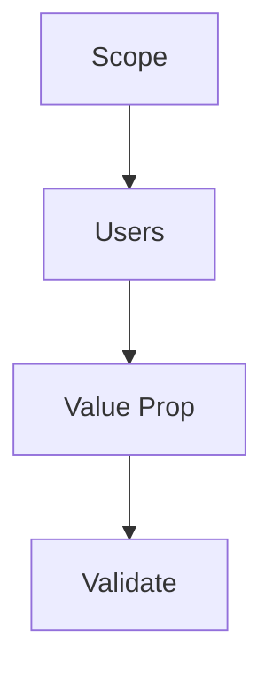

# Problem Definition and User Validation

> "The problem is not given—it is constructed with stakeholders."
> — (adapted)

---
layout: default
---

# Conceptual Core

- Scope, users, value proposition
- User research: interviews, surveys
- Validation: does it matter? Will they use it?

---
layout: default
---

# Conceptual Core (continued)

- Scope creep: stay bounded
- Problems as social constructs

---
layout: default
---

# Technical Example

- Document: scope, users, value
- 2–3 interviews
- Lab 1: Finalize, validate

---
layout: default
---

# Philosophical Reflection

- Problems negotiated
- Whose problem?
- Validation = accountability
.Figure 12.2: Problem definition framework
[plantuml,ch12-l02,png,theme=sketchy-outline]
....
@startuml
start
:Scope;
:Users;
:Value Prop;
:Validate;
stop
@enduml
....

---
layout: default
---

# Discussion Prompts

- How do we know a problem is "real"?
- What if users say one thing and do another?
- How do we handle scope creep?

---
layout: default
---

# Diagram

---
layout: default
---

# Lab Prep

- Lab 1: Finalize problem
- User validation
- Document, synthesize

---
layout: center
---

# Questions?
