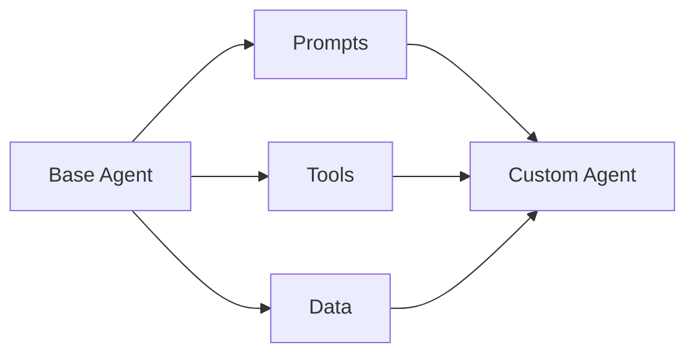

# Implementation — Customizing the Agent

> "The generic becomes specific through deployment."
> — (adapted)

---
layout: default
---

# Conceptual Core

- Customize: prompts, tools, workflows
- Domain tools, data
- Integrate: APIs, databases

---
layout: default
---

# Conceptual Core (continued)

- Testing: unit, integration, UAT
- General → situated

---
layout: default
---

# Technical Example

- Extend agent
- Custom tool if needed
- Lab 2: Implement, test

---
layout: default
---

# Philosophical Reflection

- Generic → specific
- Customization = design
- Situated artifact
.Figure 12.3: Customization points in agent
[plantuml,ch12-l03,png,theme=sketchy-outline]
....
@startuml
start
:Base Agent;
:Prompts;
:Tools;
:Data;
:Custom Agent;
stop
@enduml
....

---
layout: default
---

# Discussion Prompts

- What counts as "customization" vs. "new development"?
- How do we know the agent is "ready" for the problem?
- When should we add a custom tool?

---
layout: default
---

# Diagram

---
layout: default
---

# Lab Prep

- Lab 2: Implement agent
- Custom tools, prompts
- Test end-to-end

---
layout: center
---

# Questions?
