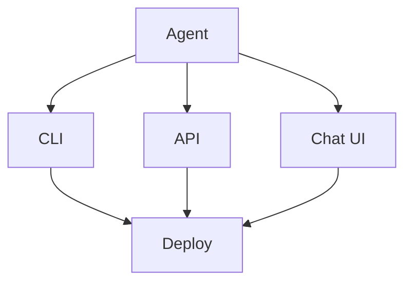

# Interface and Deployment

> "The interface is the boundary between human and system."
> — (adapted)

---
layout: default
---

# Conceptual Core

- Interfaces: CLI, API, chat UI
- Deployment: local, cloud, container
- Security: auth, rate limits, validation

---
layout: default
---

# Conceptual Core (continued)

- Interface = boundary
- Agent in the wild

---
layout: default
---

# Technical Example

- CLI or API
- Deploy locally or cloud
- Lab 2: Build, deploy, document

---
layout: default
---

# Philosophical Reflection

- Interface shapes encounter
- Deployment = beginning
- Where agent meets world
.Figure 12.4: Deployment architecture
[plantuml,ch12-l04,png,theme=sketchy-outline]
....
@startuml
start
:Agent;
:CLI;
:API;
:Chat UI;
:Deploy;
stop
@enduml
....

---
layout: default
---

# Discussion Prompts

- Which interface suits your use case?
- What security is "enough" for the capstone?
- How do we document for deployability?

---
layout: default
---

# Diagram

---
layout: default
---

# Lab Prep

- Lab 2: Interface, deploy, document
- Runnable by others

---
layout: center
---

# Questions?
