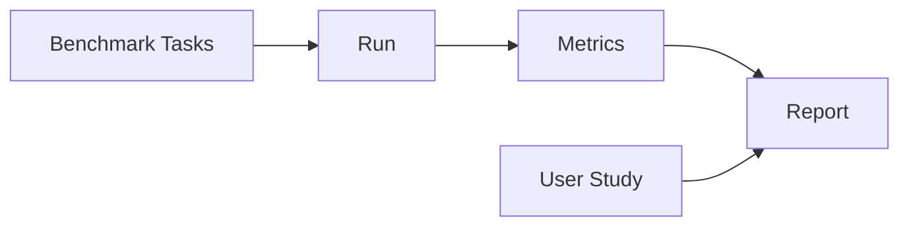

# Evaluation and Benchmarking

> "Evidence speaks—when we design how to collect it."
> — (evaluation)

---
layout: default
---

# Conceptual Core

- Metrics, baselines, comparisons
- Benchmark tasks
- User study: qualitative

---
layout: default
---

# Conceptual Core (continued)

- Document: strengths, limits, failures
- Evaluation = argument

---
layout: default
---

# Technical Example

- Run evaluation harness
- User feedback
- Lab 3: Full evaluation, document

---
layout: default
---

# Philosophical Reflection

- Evaluation = case-making
- Evidence = proof
- Report honestly
.Figure 12.5: Evaluation framework for capstone
[plantuml,ch12-l05,png,theme=sketchy-outline]
....
@startuml
start
:Benchmark Tasks;
:Run;
:Report;
:User Study;
stop
@enduml
....

---
layout: default
---

# Discussion Prompts

- What metrics matter for your domain?
- How do we balance quantitative and qualitative evidence?
- What if evaluation shows the agent fails?

---
layout: default
---

# Diagram

---
layout: default
---

# Lab Prep

- Lab 3: Full evaluation
- Benchmark, user study
- Document for thesis

---
layout: center
---

# Questions?
